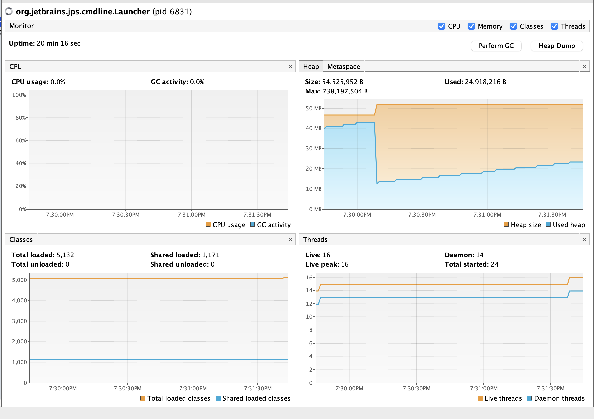
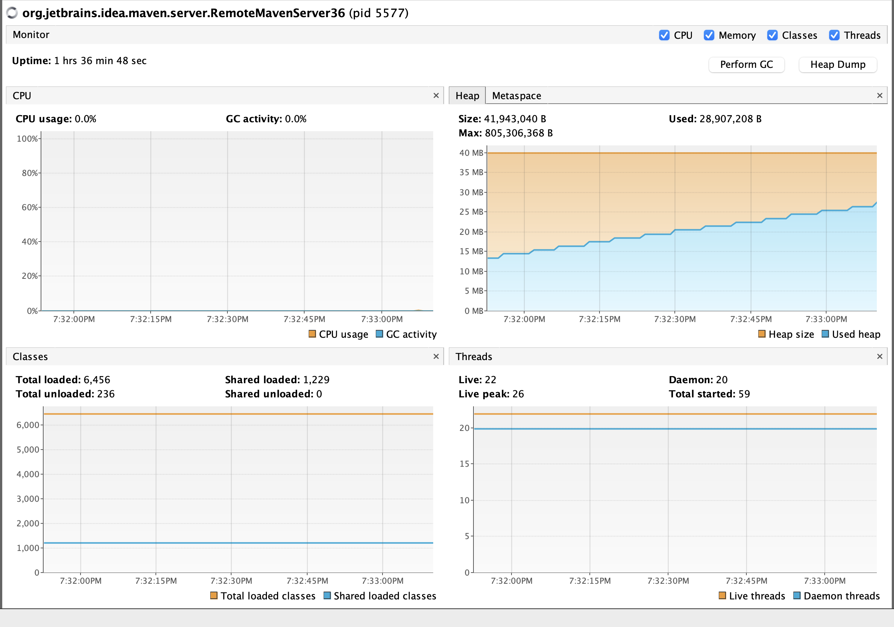

# Laboratorio 3 - Inmortasl Sync

**Elaborado por**

Juan Carlos Leal Cruz

## Parte 1. Wait/notify: Productor/Consumidor

### 1. Ejecución y monitoreo de CPU (Alto Consumo)

**Pregunta:**  
¿Por qué el consumo es alto? ¿Qué clase lo causa?

**Respuesta:**  
El consumo alto de CPU ocurre al momento de ejecutar el programa en modo `spin`. Lo anterior se debe a que se está implemantado una espera activa (busy - waiting) al momento de sincronizar.
Esto significa que los hilos quedan en un bucle infinito verificando si pueden acceder o no a la cola, de tal manera que el procesador se mantiene ocupado ejectuando instrucciones sin ninguna utilidad.
- Clase causante: `BusySpinQueue`
- Métodos causantes:
  - `put ()`
  - `take ()`
  
  Ambos métodos tienen bucles infinitos (`while(true)`) que solo ceden el paso de forma momentanea con `Thread.onSpinWait()`, lo cual no es suficiente para poder liberar de forma correcta la carga del sistema operativo.

### 2. Implementación Eficiente. Consumidor Rápido y Productor Lento
Para una correcta implementación lo que se debe de hacer es usar el modo `monitor` el cual hace empleo de la clase `BoundedBuffer` que reemplaza la espera activa por un mecanismo que se basa en monitores.

**Comportamiento:**  
Dado que el consumidor es más rápido, la cola estará frecuentemente vacía. En `BoundedBuffer`, el método `take()` evalúa `while (q.isEmpty()) { this.wait(); }`, de tal forma que al ejecutar `wait(), el hilo del consumidor libera el bloqueo y el sistema operativo lo pasa a estado WAITING, reduciendo el consumo de CPU a niveles bajos mientras se espera que el productor inserte un nuevo elemento.



### 3. Implementación Eficiente. Consumidor Lento y Productor Rápido
Para este punto se vuelve a hacer uso del modo `monitor` para así implementar la clase `BoundedBuffer`, ya que mediante el método `put` se garantiza que se respete el límite del stock de la cola.

**Comportamiento:**  
Se incluye la condición de guardia `while (q.size() == capacity) { this.wait(); }`, de tal forma que se bloquea al productor cuando la cola alcanza su capacidad máxima definida.
Lo anterior implica el que productor rápido entra en estado de espera tan pronto se llena el buffer, deteniendo su ejecución y el consumo de CPU hasta que el consumidor lento libere espacio y notifique el cambio (`notifyAll()`).



---
## Parte 2. Búsqueda distribuida y condición de parada
Para cumplir con los requisitos de terminación anticipada y exclusión mutua, se optó por usar una solución basada en monitores para garantizar tanto la integridad de los datos como la eficiencia del procesador. Esta implementación elimina las condiciones de carrera mediante bloques sincronizados y sustituye la costosa espera activa por un mecanismo de suspensión pasiva (wait/notify), permitiendo que el sistema libere recursos de hardware mientras espera y reaccione instantáneamente para detener la ejecución global una vez hallado el resultado.

### Ausencia de Condición de Carrera
Se eliminaron las condiciones de carrera sobre el contador de ocurrencias compartidas mediante la implementación de la clase `BlackListControl`.
- **Estrategia:** Se utilizó un Monitor para controlar el conteo de ocurrencias en las listas negras. La variable crítica `totalOccurrences` y la bandera `stop` están encapsuladas dentro de esta clase.
- **Implementación:** El método `reportOccurrence()` está marcado con la palabra clave `synchronized`. Esto garantiza la atomicidad de la operación: solo un hilo puede incrementar el contador y verificar si se alcanzó el límite (BLACK_LIST_ALARM_COUNT) a la vez.
- **Beneficio:** Se evita el problema de lectura sucia o actualización perdida donde dos hilos podrían leer el mismo valor del contador simultáneamente, resultando en un conteo erróneo.

A continuación, el fragmento de código donde se evidencian los cambios:
```
public synchronized void reportOccurrence() {
    totalOccurrences++;
    if (totalOccurrences >= BLACK_LIST_ALARM_COUNT) {
        stop = true;
    }
}
```

### Finalización Anticipada
El sistema ahora detiene la búsqueda tan pronto como se confirma que el host no es confiable, ahorrando recursos de CPU y tiempo de red.
- **Mecanismo:** Los hilos consultan el estado del monitor compartido antes de realizar cada validación costosa (petición al servidor de listas negras).
- **Implementación:** Dentro del bucle for del método `run()` en `BlackListSearchThread`, se verifica `control.stopSearch()`. Si devuelve true, el hilo rompe el bucle inmediatamente (break) y finaliza su ejecución.
- **Resultado:** Si el hilo A encuentra la última ocurrencia necesaria para reportar el host como malicioso, activa la bandera global. Inmediatamente, los hilos B, C y D detectan este cambio en su siguiente iteración y detienen su trabajo sin procesar el resto de servidores asignados.

A continuación, el fragmento del código mecionado:
```
for (int i = start; i < end; i++) {
    if (control.stopSearch()) {
        break; 
    }
    // ... lógica de búsqueda ...
}
```
---

## Parte 3. Sincronización y Deadlocks con Highlander Simulator
